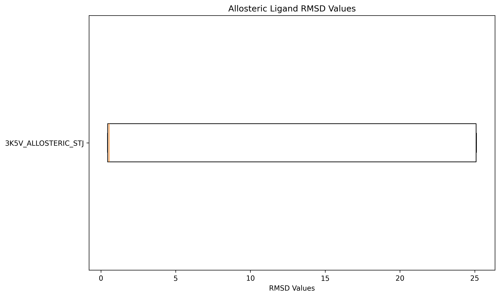
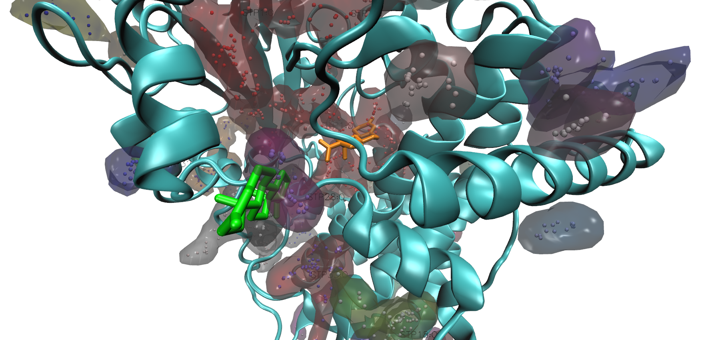

# M-Boltz Hackathon Report — Protein–Ligand Challenge

**Team name:** Cavity Crew  
**Members:** [Luis Walter](https://github.com/daandtu), [Daniel Nagel](https://github.com/braniii), and [Alejandro Poveda](https://github.com/seapovedac)  
**Repository:** [github.com/braniii/boltz-hackathon-cavitycrew](https://github.com/braniii/boltz-hackathon-cavitycrew)  

**Introduction:**  
*Boltz-2*[^1] performs well on orthosteric ligands but not on allosteric inhibitors, as most training crystal structures contain ligands in the main pocket. To identify allosteric sites, we use Boltz’s advanced steering methods to guide sampling toward alternative binding pockets.

**Method:**  
We developed an advanced algorithm to guide ligand placement using pre-determined pocket candidates. This approach integrates protein structure prediction, pocket detection, and ligand steering to improve sampling of both orthosteric and allosteric sites. The algorithm consists of the following steps:

1. We run *Boltz* to predict the structure of the protein without any bound ligand.
1. We use the *fpocket*[^2] program to detect potential binding pockets.
1. For the top predicted pockets, we run a *Boltz* prediction with the ligand restrained to the pocket, adding spatial constraints to guide placement more precisely.
1. We calculate predicted binding affinities for each ligand.
1. Predicted structures are ranked by affinity and confidence, returning only the most reliable ligand–protein complexes.

**Results:**  
Upon investigating 3K5V, we found that the allosteric binding pocket had not been identified correctly. Using FPocket, we identified the correct binding site, improving the top 1 prediction out of 5 from 2.5 nm below 0.2 nm.

| Boltz2-RMSD  | fpocket |
| ------------- | ------------- |
|   |   |

**Conclusion:**  
Integrating *fpocket* with *Boltz* improves allosteric ligand predictions. The workflow is reproducible and compliant with the hackathon evaluation setup.

[^1]: Passaro, S. et al. Boltz-2: Towards Accurate and Efficient Binding Affinity Prediction. (2025) [doi:10.1101/2025.06.14.659707](https://doi.org/10.1101/2025.06.14.659707).
[^2]: Le Guilloux, V., Schmidtke, P. & Tuffery, P. Fpocket: An open source platform for ligand pocket detection. BMC Bioinformatics 10, (2009). 
